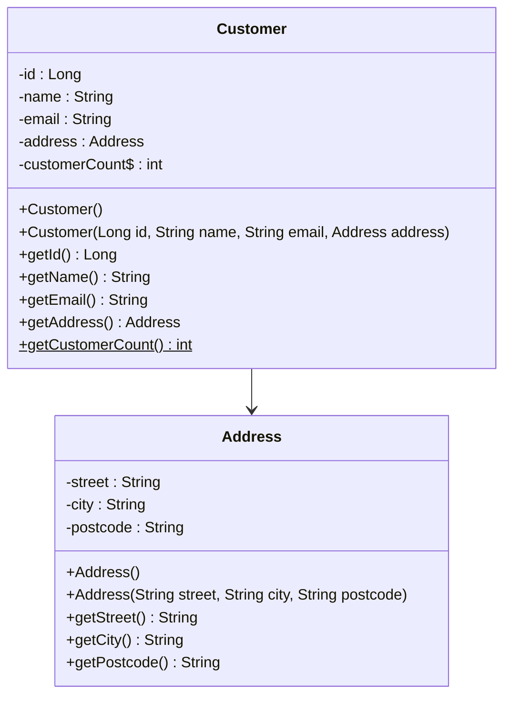

```mermaid
classDiagram
class Customer {
    -id : Long 
    -name : String
    -email : String
    -address : Address
    -customerCount$ : int
    +Customer()
    +Customer(Long id, String name, String email, Address address)
    +getId() Long
    +getName() String
    +getEmail() String
    +getAddress() Address
    +getCustomerCount() int$
}

class Address {
    -street : String
    -city : String
    -postcode : String
    +Address()
    +Address(String street, String city, String postcode)
    +getStreet() String
    +getCity() String
    +getPostcode() String
}

Customer --> Address
```